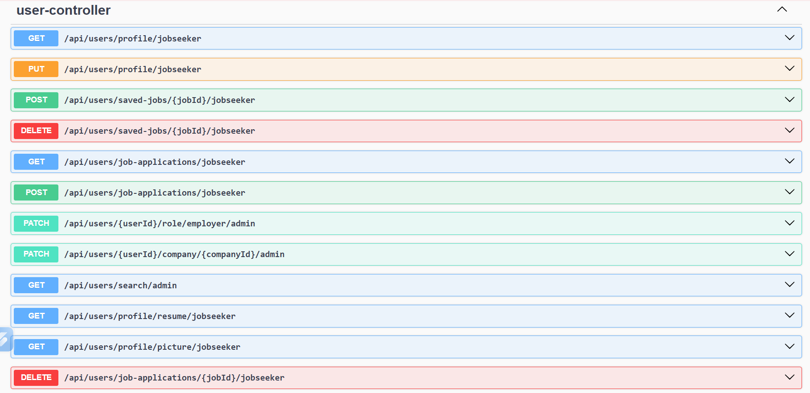
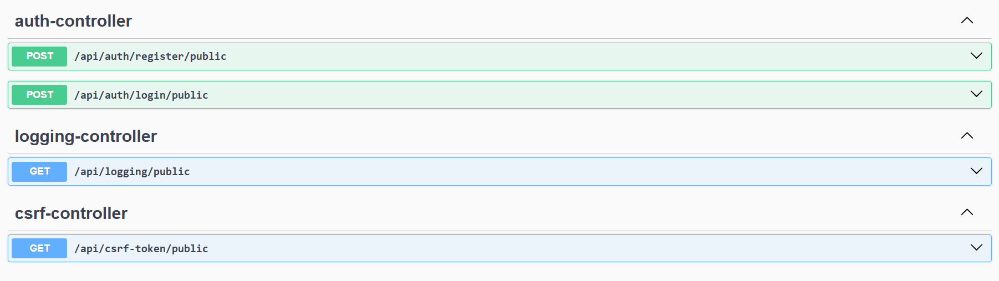
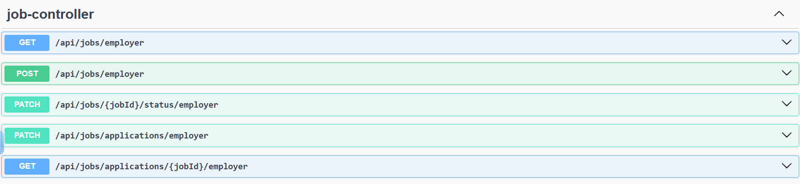
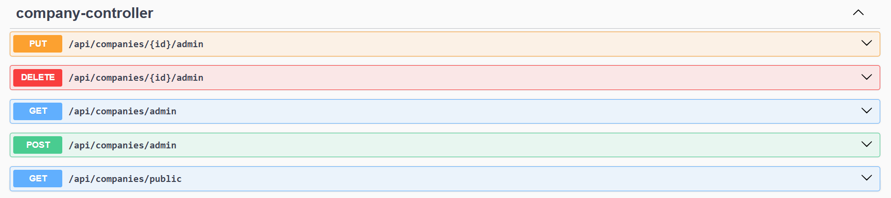
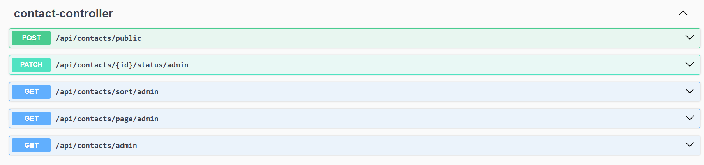

# Job Portal Backend

Backend REST API built using:

- Java 21
- Spring Boot
- Spring Security
- JWT Authentication
- MySQL
- AWS Deployment

## Features

- User Registration
- Login Authentication
- Role Based Authorization
- Job Posting
- Job Search
- Apply Jobs

## Tech Stack

Java, Spring Boot, MySQL, AWS

## Deployment

Deployed on AWS EC2

## Architecture

Monolithic Spring Boot Application

## API Documentation

### Swagger UI

### Authentication API

### Job APIs

### Company APIs

### Contact APIs

